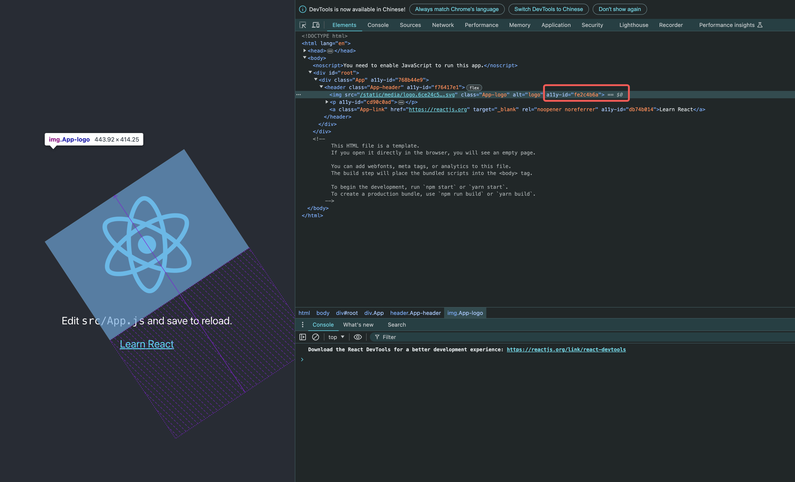

# a11y-webpack-loader

webpack 构建 loader，添加固定的 a11y-id 属性便于标注。（支持 JSX 源代码或产物代码）

[English Version](./README.md)

## 使用方法

1、在你的项目中，安装 a11y-webpack-loader 包。这里以 npm 为示例。

```
npm install a11y-webpack-loader --save-dev
```

2、配置 webpack 的 loader 规则。这里以 create-react-app 生成的项目为例。

```
// config-overrides.js 文件，如没有需新增
const { override } = require('customize-cra');

module.exports = override((config, env) => {
  config.devServer = {
    ...config.devServer,
    setupMiddlewares: (middlewares) => middlewares,
  };
  return {
    ...config,
    module: {
      ...config.module,
      rules: [
        ...config.module.rules,
        {
          test: /\.js$/,
          exclude: /node_modules/,
          use: {
            loader: require.resolve('a11y-webpack-loader'),
          },
        },
      ],
    },
  };
});
```

使用项目 Example 可参考 [a11y-webpack-loader-react](https://github.com/bytedance/a11y-cloud/examples/a11y-webpack-loader-react)

## 效果

1、loader 执行后，会为源代码或产物代码添加固定的 a11y-id 属性。


2、在标注工具中，可以通过 a11y-id 属性找到对应的标注内容。


3、标注工具中标注后，会自动生成对应的无障碍属性，标注完成。


**详细使用方法请参考主项目 [a11y-cloud](https://github.com/bytedance/a11y-cloud)**

## 支持 React 版本 >= 16.0.0，Webpack 版本 >= 4.0.0
