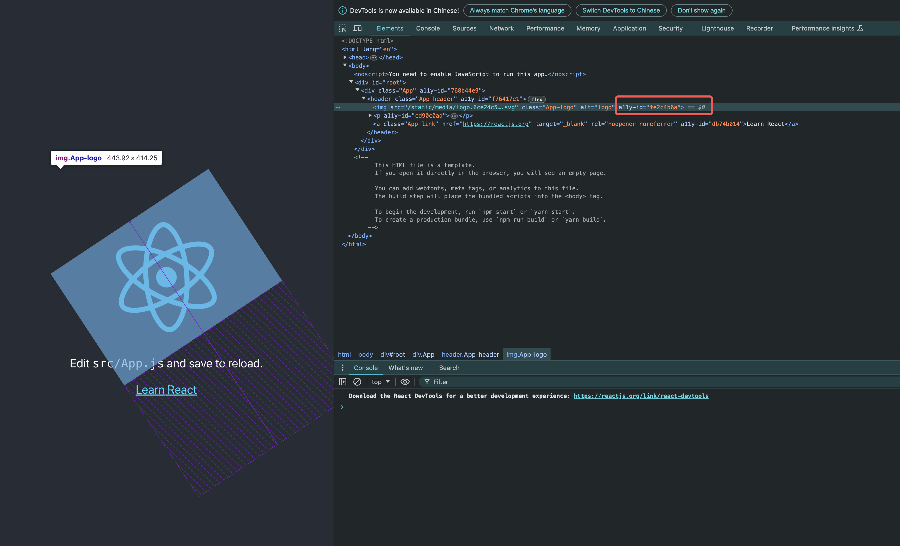
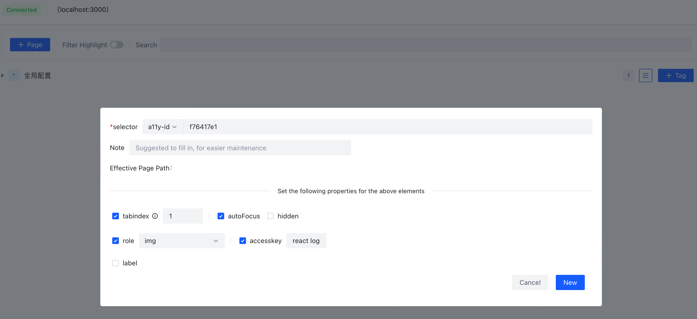
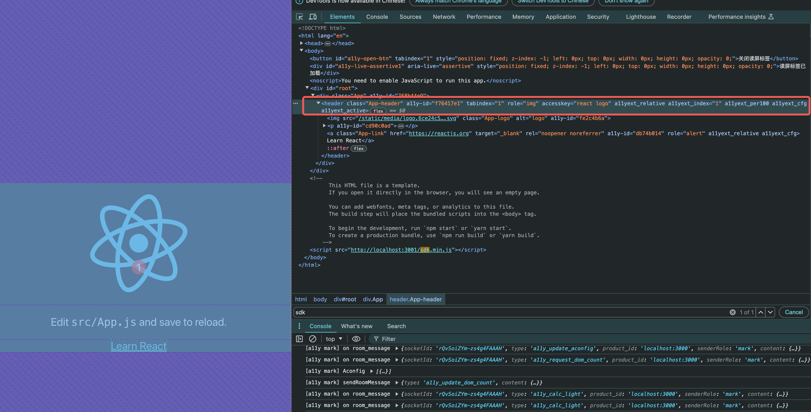

# a11y-webpack-loader

Webpack build loader that adds a fixed a11y-id attribute to facilitate annotation. (Supports JSX source code or output code)

[中文版本](./README.CN.md)

## Usage

1. Install the a11y-webpack-loader package in your project. Here is an example using npm.

```bash
npm install a11y-webpack-loader --save-dev
```

2. Configure the webpack loader rule. Here is an example using a project generated by create-react-app.

```javascript
// config-overrides.js file, create if it doesn't exist
const { override } = require("customize-cra");

module.exports = override((config, env) => {
  config.devServer = {
    ...config.devServer,
    setupMiddlewares: (middlewares) => middlewares,
  };
  return {
    ...config,
    module: {
      ...config.module,
      rules: [
        ...config.module.rules,
        {
          test: /\.js$/,
          exclude: /node_modules/,
          use: {
            loader: require.resolve("a11y-webpack-loader"),
          },
        },
      ],
    },
  };
});
```

For project examples, you can refer to [a11y-webpack-loader-react](https://github.com/bytedance/a11y-cloud/examples/a11y-webpack-loader-react).

## Effects

1. After the loader is executed, it will add a fixed a11y-id attribute to the source code or the output code.
   

2. In the annotation tool, you can find the corresponding annotation content through the a11y-id attribute.
   

3. After annotation in the annotation tool, the corresponding accessibility attributes will be automatically generated, and the annotation is complete.
   

**For detailed usage, please refer to the main project [a11y-cloud](https://github.com/bytedance/a11y-cloud).**

## Support React Version >= 16.0.0，Webpack Version >= 4.0.0
